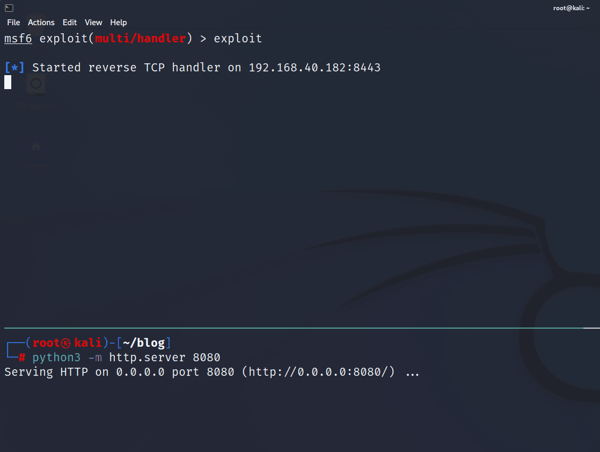

# GwisinMsi 

This repo contains the PoC of the MSI payload used in the blog post (TODO). The payload is based on the Gwisin ransomware's MSI payload analysis of the AhnLab ASEC team's [blog post](https://asec.ahnlab.com/en/37483/).

## DLL Compiling Configuration 
- Project > Project properties > c/c++ > preprocessor > processor definition - `_CRT_SECURE_NO_WARNINGS` 
- Project > Project properties > Charset > Multi-byte 

## Credits and References 
- [HuskyHacks](https://huskyhacks.dev/) - MSI Payload [Blog Post](https://notes.huskyhacks.dev/notes/ms-interloper-on-the-subject-of-malicious-msis) 
- [ASEC AhnLab](https://asec.ahnlab.com/en/) - [blog post](https://asec.ahnlab.com/en/37483/)
- [SK Shieldus](https://www.skshieldus.com/download/files/download.do?o_fname=%EA%B7%80%EC%8B%A0(Gwisin)%20%EB%9E%9C%EC%84%AC%EC%9B%A8%EC%96%B4%20%EA%B3%B5%EA%B2%A9%20%EC%A0%84%EB%9E%B5%20%EB%B6%84%EC%84%9D%20%EB%A6%AC%ED%8F%AC%ED%8A%B8.pdf&r_fname=20220824150111854.pdf)
- [Atomic Red Team](https://github.com/redcanaryco/atomic-red-team/blob/master/atomics/T1218.007/T1218.007.md) 

## Demo 
